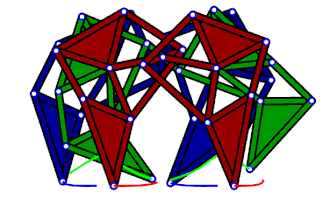

# Strandbeest Leg Optimization Using Genetic Algorithms



Source: https://en.wikipedia.org/wiki/Leg_mechanism


## Technical Documentation

### Overview
This document describes the implementation of a genetic algorithm (GA) designed to optimize the leg mechanism of Theo Jansen's Strandbeest. The algorithm aims to find optimal proportions for the 11-bar linkage system that creates the characteristic walking motion of these kinetic sculptures.

### Problem Definition
The Strandbeest leg mechanism consists of 11 connected bars that form a walking linkage. The optimization challenge is to determine the optimal lengths of these bars to achieve:
1. A nearly horizontal motion during the ground contact phase
2. Appropriate foot clearance during the return phase
3. Mechanical feasibility and stability

### Algorithm Implementation

#### Chromosome Structure
Each solution is represented as a list of 11 floating-point numbers corresponding to the lengths of the bars in the mechanism. The chromosome structure is:
```python
lengths = [crank_length, bar_2_length, ..., bar_11_length]
```

#### Fitness Function
The fitness function evaluates three key aspects:

1. Ground Flatness (50% weight)
   - Measures deviation from horizontal during ground contact phase
   - Lower deviation scores higher
   - Critical for smooth walking motion

2. Step Height (30% weight)
   - Evaluates foot clearance during return phase
   - Penalizes both insufficient and excessive height
   - Optimal range: 15-25% of mechanism height

3. Mechanical Complexity (20% weight)
   - Penalizes impractical bar length ratios
   - Considers manufacturing feasibility
   - Promotes robust mechanical design

#### Genetic Operators

##### Selection
- Tournament selection with size 5
- Provides good balance between exploration and exploitation
- Maintains genetic diversity while favoring better solutions

##### Crossover
- Single-point crossover
- Crossover point randomly selected
- Preserves successful sub-structures of solutions

##### Mutation
- Gaussian mutation with 10% mutation rate
- Maximum mutation magnitude: ±10% of current value
- Helps escape local optima and maintains diversity

#### Evolution Strategy
- Population size: 100 individuals
- Elitism: Top 10% preserved
- Termination: 1000 generations or convergence
- Convergence defined as < 1% improvement over 50 generations

### Performance Metrics

The algorithm tracks several metrics during optimization:
1. Best fitness per generation
2. Population diversity
3. Convergence rate
4. Constraint violations

### Validation
Solutions are validated through:
1. Kinematic simulation
2. Physical feasibility checks
3. Stability analysis

### Implementation Notes

#### Critical Considerations
1. All length measurements are in millimeters
2. Minimum bar length: 10mm
3. Maximum bar length: 100mm
4. Angular resolution: 50 points per cycle

#### Optimization Parameters
- Population size: 100
- Generations: 1000
- Mutation rate: 0.1
- Tournament size: 5
- Elite count: 10

### Results Analysis

The optimization typically produces results with:
1. Ground contact deviation < 5mm
2. Step height between 15-25% of mechanism height
3. All bar lengths within manufacturable ranges

### Future Improvements

Potential enhancements include:
1. Multi-objective optimization
2. Dynamic mutation rates
3. Advanced crossover methods
4. Real-time visualization
5. Parallel evaluation

### References
1. Jansen, Theo. "The Great Pretender." 010 Publishers, 2007
2. Holland, John H. "Adaptation in Natural and Artificial Systems"
3. Goldberg, David E. "Genetic Algorithms in Search, Optimization and Machine Learning"